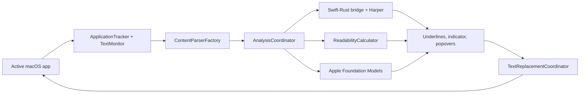

# TextWarden Architecture

TextWarden is a native macOS writing assistant. It checks spelling, grammar, punctuation, readability, and optional writing style while someone types in another application or in TextWarden's own Sketch Pad. The app combines Swift and SwiftUI, the macOS Accessibility API, a Rust grammar engine built on Harper, and Apple's on-device Foundation Models framework.

This document explains the current code boundaries and the safest places to extend them.

## System Overview

The main application target supports macOS 14 and later. Grammar checking works locally on that baseline. Style suggestions, text generation, and AI-assisted readability tips require macOS 26, an eligible Apple Silicon Mac, and Apple Intelligence enabled in System Settings.


```mermaid
flowchart LR
    App["Active macOS app"] --> Monitor["ApplicationTracker + TextMonitor"]
    Monitor --> Parser["ContentParserFactory"]
    Parser --> Coordinator["AnalysisCoordinator"]
    Coordinator --> Grammar["Swift-Rust bridge + Harper"]
    Coordinator --> Readability["ReadabilityCalculator"]
    Coordinator --> AI["Apple Foundation Models"]
    Grammar --> Presentation["Underlines, indicator, popovers"]
    Readability --> Presentation
    AI --> Presentation
    Presentation --> Replacement["TextReplacementCoordinator"]
    Replacement --> App
```

The grammar engine and Apple Foundation Models run on the device. TextWarden does not need a hosted grammar or LanguageTool server. Sparkle handles app updates separately from text analysis.

## Repository Layout

```text
Sources/
├── Accessibility/      Active-app tracking, AX permissions, and text monitoring
├── App/                Application lifecycle and AnalysisCoordinator extensions
├── AppConfiguration/   Per-app capabilities, behaviors, quirks, and timing
├── ContentParsers/     App-specific extraction and positioning adjustments
├── GrammarBridge/      Swift models and the generated Rust FFI boundary
├── Models/             Preferences, vocabulary, statistics, logging, and domain data
├── Overlay/            Overlay rendering and visibility state
├── Positioning/        AX helpers, coordinate conversion, and geometry strategies
├── SketchPad/          TextWarden's built-in editor
├── TextReplacement/    Validated AX or keyboard-based replacements
├── UI/                 Menu bar, settings, indicator, popovers, and windows
└── Utilities/          Index conversion, filtering, retries, metrics, and diagnostics

GrammarEngine/
├── src/                Rust analyzer, FFI bridge, language filter, and wordlist loader
├── wordlists/          Dictionaries embedded into the Rust static library
└── generated/          swift-bridge generated headers and Swift bindings

Tests/
├── Contract/           Swift-Rust boundary tests
├── Integration/        Coordinator, monitor, and popover behavior tests
├── Performance/        Opt-in performance benchmarks
└── Unit/               Focused Swift unit tests

Scripts/                Build, release, signing, and documentation tooling
Resources/              Help Book resources and packaged assets
```

## Runtime Data Flow

### 1. Find the text source

`ApplicationTracker` reports the frontmost application as an `ApplicationContext`. `AnalysisCoordinator` checks global, application, and temporary-pause preferences before asking `TextMonitor` to observe the focused editable element.

`TextMonitor` uses Accessibility notifications for focus and value changes. The relevant callbacks are:

- `onImmediateTextChange`, used to react to typing before slower extraction completes
- `onTextChange`, used after the current text has been extracted and preprocessed

Accessibility implementations vary widely. TextWarden sets a one-second AX messaging timeout, records call latency through `AXWatchdog`, and temporarily skips calls to an application after a slow or hung request. Apps marked with `AppFeatures.defersTextExtraction`, plus apps whose measured average AX latency exceeds 0.3 seconds, wait for the 0.8-second slow-app debounce before extracting text.

### 2. Parse the application content

`ContentParserFactory` asks `AppRegistry` which `ParserType` belongs to the active bundle identifier. It returns one of the dedicated parsers or `GenericContentParser`.

The `ContentParser` protocol covers more than string cleanup. A parser can:

- extract text from a non-standard accessibility tree;
- reject elements that are not editable content;
- remove quoted messages, signatures, or other app-owned text before analysis;
- adjust selection offsets and UTF-16 handling;
- provide custom bounds or app-specific geometry adjustments;
- disable visual underlines when reliable positioning is not possible.

The current factory includes dedicated parsers for Slack, Claude, browsers, Notion, Mail, Word, PowerPoint, Outlook, Teams, and Webex.

### 3. Run grammar analysis

`AnalysisCoordinator` stores the current `TextSegment`, captures the user's grammar settings on the main actor, then dispatches Harper analysis to `analysisQueue`.

Each background request carries a `GrammarAnalysisRequest` with four identity checks:

- generation number;
- source text;
- application context;
- monitored `AXUIElement` identity.

When work returns to the main actor, all four values must still match. A focus change, new edit, stopped monitor, or newer request invalidates the old result. This prevents a result from one field or document from appearing in another.

`Sources/GrammarBridge/GrammarEngine.swift` converts the captured settings to swift-bridge values. `GrammarEngine/src/bridge.rs` exposes the FFI-safe API, and `GrammarEngine/src/analyzer.rs` builds a Harper `Document`, configures its linter, and returns Unicode-scalar ranges with messages and suggestions.

The Rust dictionary combines Harper's curated dictionary with whichever bundled wordlists the user enabled:

- internet abbreviations;
- Gen Z slang;
- IT terminology;
- brands and product names;
- first names;
- surnames.

The merged dictionary is cached by that six-flag configuration. `whatlang` provides optional detection across its full 70-language catalog. Swift receives that catalog through the Rust FFI and persists selected non-English languages as ISO 639-3 codes rather than maintaining a second detector list.

For each analysis, Rust detects the language of semantic segments once and records both UTF-8 byte ranges and Unicode-scalar ranges. The same summary drives the early Harper skip, readability decision, and post-analysis error filtering. Only reliable detections matching a selected language are ignored; unknown or unreliable segments fail open. Harper is skipped for the complete document only when selected languages cover more than 60% of all substantive segments.

### 4. Filter and enrich results

`GrammarErrorFilter` runs in Swift after Harper. It removes disabled categories and ignored rules, then checks the user's custom vocabulary, the macOS learned-word dictionary, and globally ignored error text. Keeping these user-controlled filters outside the Rust dictionary makes changes visible without rebuilding the merged dictionary.

`ReadabilityCalculator` calculates Flesch Reading Ease for English text. `AnalysisCoordinator` only runs the document readability path when the feature is enabled and the text has at least 30 words. Sentence-level results are evaluated against the selected target audience.

Optional style work is debounced and sent to `FoundationModelsEngine`. It uses structured `@Generable` output on macOS 26 and supports the Consistent, Balanced, and Creative presets. Style results have their own LRU cache, generation guard, and `SuggestionTracker` filtering.

### 5. Present suggestions

`UnifiedSuggestion` gives grammar, style, and readability items a common UI shape while preserving engine-specific fields such as Harper lint IDs, alternative corrections, AI confidence, and readability scores.

The floating indicator can show three sections:

| Section | Content |
|---|---|
| Grammar | Spelling, grammar, and punctuation results |
| Style and clarity | Foundation Models style suggestions and readability state |
| Text generation | On-device Foundation Models generation action |

`ErrorOverlayWindow` owns the transparent overlay used for inline marks. `UnderlineStateManager` updates grammar, style, and readability underlines as one immutable `UnderlineState`, including hover and locked-highlight indices.

Visual underlines are shown only when every relevant gate passes:

1. The global and per-app underline preferences are enabled.
2. The app configuration allows visual underlines.
3. The current error count does not exceed `UserPreferences.maxErrorsForUnderlines`, whose default is 10.
4. Apps that require a typing pause are no longer in an active typing state.
5. Positioning returns usable bounds with confidence of at least 0.5.

The floating indicator can still show a result count when inline positioning is unavailable.

## Application Configuration

TextWarden intentionally separates technical capabilities from interaction behavior.

### AppRegistry

`Sources/AppConfiguration/AppRegistry.swift` is the source of truth for `AppConfiguration`. It selects:

- the content parser;
- preferred and disabled positioning strategies;
- standard or browser-style replacement;
- font assumptions;
- feature flags such as typing pauses, deferred extraction, formatted text, and frame validation.

The registry also assigns one default product policy to every bundle identifier: supported,
safe trial, paused by default, or ignored. `UserPreferences` stores only the user's overrides;
settings views must not change application state merely by listing an app.

Unknown applications can be probed by `StrategyProfiler`. `StrategyRecommendationEngine` turns the observed AX capabilities into a configuration, and `StrategyProfileCache` stores the result in `~/Library/Application Support/TextWarden/strategy-profiles.json`. Profiles expire after seven days.

### AppBehaviorRegistry

`Sources/AppConfiguration/AppBehaviorRegistry.swift` stores the full overlay behavior for each known bundle identifier. Every `AppBehavior` supplies:

```swift
protocol AppBehavior {
    var bundleIdentifier: String { get }
    var displayName: String { get }
    var underlineVisibility: UnderlineVisibilityBehavior { get }
    var popoverBehavior: PopoverBehavior { get }
    var scrollBehavior: ScrollBehavior { get }
    var mouseBehavior: MouseBehavior { get }
    var coordinateSystem: CoordinateSystemBehavior { get }
    var timingProfile: TimingProfile { get }
    var knownQuirks: Set<AppQuirk> { get }
    var usesUTF16TextIndices: Bool { get }
}
```

Known applications get explicit behavior files under `Sources/AppConfiguration/Behaviors/`. Unknown bundle identifiers receive a conservative `DefaultBehavior`. Keeping Slack, Notion, Mail, Office, and browser behavior separate prevents a fix for one accessibility implementation from changing another.

## Position Resolution

`PositionResolver` chooses geometry providers from the active app configuration. The registered strategies are sorted into four tiers:

1. `precise`: dedicated app strategies, text markers, Chromium, and AX range bounds;
2. `reliable`: insertion point, element tree, line index, origin, and anchor search;
3. `estimated`: font metrics;
4. `fallback`: reserved for last-resort implementations.

Each `GeometryProvider` reports a `GeometryResult` containing Cocoa screen bounds, optional per-line bounds, confidence, a strategy name, and debug metadata. A result is usable only when its confidence is at least 0.5 and its bounds have positive width and height.

The resolver checks visibility and the AX watchdog before trying a strategy. It validates returned bounds against the editable area, caches successful geometry, and clears both the shared cache and strategy-owned caches when the text layout changes. If the range is off-screen or every safe strategy fails, it returns an unavailable result instead of drawing in the wrong place.

### Coordinate systems and text indices

Accessibility geometry normally arrives in Quartz coordinates, whose origin is at the top left. AppKit and SwiftUI use Cocoa screen coordinates, whose origin is at the bottom left. Use `CoordinateMapper` for those conversions.

Harper reports Unicode-scalar offsets. Target AX APIs may expect grapheme-cluster or UTF-16 offsets. Use `TextIndexConverter`; do not duplicate conversion code. Emoji and zero-width-joiner sequences are the common failure cases.

## Text Replacement

`TextReplacementCoordinator` is the narrow replacement entry point. It creates a `ReplacementContext`, asks `ReplacementValidator` to confirm the element, bounds, and expected source text, then routes by `AppFeatures.textReplacementMethod`:

| Method | Implementation | Intended target |
|---|---|---|
| `.standard` | `StandardReplacement` | Apps where AX value replacement works |
| `.browserStyle` | `KeyboardReplacement` | Browser, Electron, WebKit, and Office cases that require selection plus paste |

`ReplacementContext` starts with Harper's Unicode-scalar range and converts it to UTF-16 or grapheme indices according to `AppBehavior.usesUTF16TextIndices`. A failed conversion or source-text mismatch stops the replacement.

Some applications still need additional coordination in `AnalysisCoordinator+TextReplacement.swift`, including WebKit markers, Slack formatting preservation, focus-bounce recovery, and forced reanalysis after a paste. New code should use `TextReplacementCoordinator` for the common path before adding an app-specific exception.

## Sketch Pad

`Sources/SketchPad/` is TextWarden's built-in writing workspace. `SketchPadViewModel` calls `GrammarEngine` directly, calculates document and selection readability, and uses `FoundationModelsEngine` for style suggestions or readability tips when Apple Intelligence is available. Its underline view is separate from the cross-application AX overlay because TextWarden owns the editor and its layout.

Documents and window state live in the Sketch Pad model and store classes. Markdown import, extraction, rendering, and attributed-string formatting are kept in the same module.

## Threading and Ownership

`AnalysisCoordinator`, `TextMonitor`, the dependency protocols that touch application state, and the main UI controllers are isolated to `@MainActor`.

Background work is limited to components that are designed for it:

- `analysisQueue` runs synchronous Rust grammar calls;
- Swift concurrency runs Foundation Models operations without blocking the main actor;
- `ResourceMonitor` samples on a utility queue;
- `AIRephraseCache` and `StrategyProfileCache` provide their own synchronization.

Keep these rules when extending the code:

- Capture user preferences and AX identity on the main actor before dispatching work.
- Return UI and observable-state mutations to the main actor.
- Treat every AX call as fallible and potentially slow.
- Use weak captures for long-lived callbacks and event monitors.
- Invalidate timers before replacing them, and remove global event monitors during cleanup.
- Reject stale asynchronous results instead of trying to reconcile them with newer text.

## Dependency Injection

`Sources/App/Dependencies.swift` defines the service protocols used by `AnalysisCoordinator` and its extensions. `DependencyContainer.production` wires the real implementations, including `GrammarEngine`, `AppRegistry`, `PositionResolver`, `ContentParserFactory`, `TypingDetector`, and `TextReplacementCoordinator`.

Tests can construct a `DependencyContainer` with mocks for the protocol-backed services. `Services.current` is a small bridge for code that cannot yet receive a dependency through an initializer; constructor injection remains the preferred path.

## Design Rules

### Fail closed around text and geometry

Do not apply a correction unless the source text still matches. Do not draw an underline unless the bounds are visible and usable. A missing suggestion is safer than changing or marking the wrong text.

### Use the shared infrastructure

Before adding a helper, check these locations:

| Need | Existing type |
|---|---|
| Text index conversion | `TextIndexConverter` |
| Quartz/Cocoa conversion | `CoordinateMapper` |
| Safe AX access | `AccessibilityBridge` and `AXAsyncBridge` |
| Position retries | `RetryScheduler` |
| Clipboard preservation | `ClipboardManager` |
| Grammar filtering | `GrammarErrorFilter` |
| Overlay visibility | `OverlayStateMachine` and `UnderlineStateManager` |

### Log through Logger

Use `Logger`, never `print()`. The available categories are `general`, `permissions`, `analysis`, `accessibility`, `ffi`, `llm`, `ui`, `performance`, `errors`, `lifecycle`, and `rust`. Levels run from `trace` through `critical`.

```swift
Logger.info("User accepted suggestion", category: Logger.ui)
Logger.debug("AX bounds unavailable", category: Logger.accessibility)
Logger.error("Style analysis failed: \(error.localizedDescription)", category: Logger.llm)
```

Do not log monitored text. Log identifiers, lengths, categories, timings, and error metadata instead.

## How to Add a New App

Most applications start with `DefaultBehavior` plus an automatically generated capability profile. Add explicit support only when testing shows that the generic path is unreliable.

1. Add an `AppBehavior` under `Sources/AppConfiguration/Behaviors/` and register it in `AppBehaviorRegistry`.
2. If the app needs a parser, dedicated strategy, or feature override, add an `AppConfiguration` to `AppRegistry`.
3. Reuse an existing `ParserType` and positioning strategy when its AX behavior really matches. Otherwise implement the relevant protocol and register the new type.
4. Add regression tests for the discovered AX behavior and for any new app configuration.
5. Run `make run` for manual testing in the target app, then run `make ci-check` before committing.

Application-specific investigation belongs under `docs/applications/` when future debugging depends on the AX tree or a known third-party app quirk.

## Testing and Build Flow

```bash
make run       # Build, install in /Applications, and launch
make test      # Run Rust tests and the selected Swift test suite
make ci-check  # Format checks, lint, Rust tests, Swift tests, and release build
```

`make test` includes the Rust suite plus selected Swift unit, contract, and integration test classes. The performance benchmarks under `Tests/Performance/` are not part of that default Swift invocation.

`make build` builds the Rust static library for Intel and Apple Silicon, combines it into a universal library, rebuilds the Help Book with Pandoc, and then builds the Xcode target. See [BUILD.md](BUILD.md) for prerequisites and [CONTRIBUTING.md](CONTRIBUTING.md) for branch, commit, and pull-request rules.
