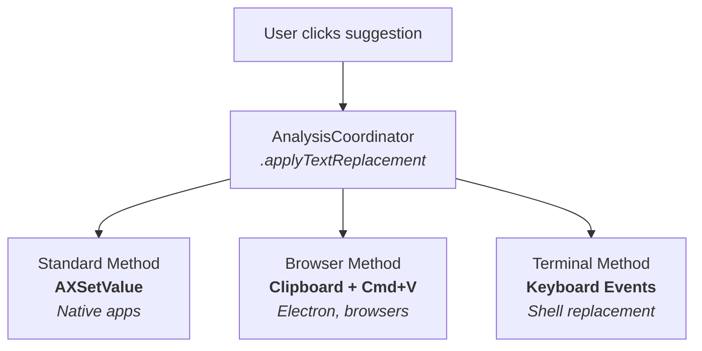

# TextWarden Architecture

This document describes the architecture, design patterns, and coding principles for the TextWarden codebase. It's intended for contributors who want to understand how the system works and how to write code that fits the existing patterns.

## High-Level Overview

TextWarden is a macOS menu bar application that monitors text input across all applications and provides grammar checking and style suggestions in real-time.


**Swift Layer** handles:
- macOS Accessibility API integration (monitoring text changes)
- Application-specific text parsing and filtering
- Error position calculation for visual underlines
- UI rendering (suggestion popovers, error indicators)
- Text replacement operations
- Apple Intelligence integration via FoundationModelsEngine

**Rust Layer** (GrammarEngine) handles:
- Grammar analysis via Harper library
- Language detection via whichlang
- Custom vocabulary support (slang, IT terms, brand names)

**Apple Intelligence** (macOS 26+):
- Style suggestions via Foundation Models framework
- On-device processing with complete privacy
- Writing style adaptation (formal, casual, concise, business)

## Directory Structure

```
Sources/
├── App/                                          # Application lifecycle and orchestration
│   ├── TextWardenApp.swift                       # Main entry point (@main)
│   ├── AnalysisCoordinator.swift                 # Central orchestrator
│   ├── AnalysisCoordinator+GrammarAnalysis.swift # Grammar analysis extension
│   ├── AnalysisCoordinator+StyleChecking.swift   # Style checking extension
│   ├── AnalysisCoordinator+TextReplacement.swift # Text replacement extension
│   ├── AnalysisCoordinator+WindowTracking.swift  # Window tracking extension
│   ├── FoundationModelsEngine.swift              # Apple Intelligence integration
│   ├── StyleInstructions.swift                   # AI prompt templates
│   ├── StyleTypes+Generable.swift                # @Generable structs for AI output
│   ├── AIRephraseCache.swift                     # Cache for AI rephrase suggestions
│   ├── MenuBarController.swift                   # Menu bar UI
│   ├── PreferencesWindowController.swift         # Preferences window management
│   ├── Dependencies.swift                        # Dependency injection container
│   ├── UpdaterViewModel.swift                    # Sparkle auto-updater
│   ├── CrashRecoveryManager.swift                # Crash detection and recovery
│   └── VirtualKeyCodes.swift                     # Keyboard event codes
│
├── Accessibility/                                # macOS Accessibility API layer
│   ├── TextMonitor.swift                         # Monitors text changes via AX observers
│   ├── ApplicationTracker.swift                  # Tracks active app/window focus
│   ├── PermissionManager.swift                   # Accessibility permission handling
│   ├── BrowserURLExtractor.swift                 # Extracts URLs from browser address bars
│   └── CGWindowHelper.swift                      # Window-level helpers
│
├── ContentParsers/                               # App-specific text extraction
│   ├── ContentParser.swift                       # Protocol definition
│   ├── ContentParserFactory.swift                # Factory for parser instantiation
│   ├── GenericContentParser.swift                # Default parser
│   ├── BrowserContentParser.swift                # Chrome, Safari, Firefox, Arc
│   ├── SlackContentParser.swift                  # Slack rich text handling
│   ├── NotionContentParser.swift                 # Notion blocks parsing
│   ├── MailContentParser.swift                   # Apple Mail
│   ├── WordContentParser.swift                   # Microsoft Word
│   ├── PowerPointContentParser.swift             # Microsoft PowerPoint
│   ├── TeamsContentParser.swift                  # Microsoft Teams
│   └── TerminalContentParser.swift               # Terminal emulators
│
├── Positioning/                                  # Error underline position calculation
│   ├── PositionResolver.swift                    # Strategy orchestrator
│   ├── AccessibilityBridge.swift                 # AX API helpers
│   ├── CoordinateMapper.swift                    # Quartz ↔ Cocoa coordinate conversion
│   ├── GeometryProvider.swift                    # Strategy protocol
│   ├── GeometryConstants.swift                   # Bounds validation constants
│   ├── PositionCache.swift                       # Position caching
│   ├── TypingDetector.swift                      # Detects typing pauses
│   ├── TextAnchor.swift                          # Text anchor utilities
│   └── Strategies/                               # Positioning algorithms
│       ├── RangeBoundsStrategy.swift             # AXBoundsForRange
│       ├── LineIndexStrategy.swift               # Line + offset calculation
│       ├── TextMarkerStrategy.swift              # AXTextMarker APIs
│       ├── InsertionPointStrategy.swift          # Cursor-based fallback
│       ├── AnchorSearchStrategy.swift            # Probe nearby characters
│       ├── ChromiumStrategy.swift                # Electron/Chromium heuristics
│       ├── FontMetricsStrategy.swift             # Font-based calculation
│       ├── ElementTreeStrategy.swift             # Element hierarchy traversal
│       ├── OriginStrategy.swift                  # Origin-based positioning
│       └── Legacy/                               # Deprecated (reference only)
│
├── AppConfiguration/                             # Per-application settings
│   ├── AppRegistry.swift                         # Single source of truth for configs
│   ├── AppConfiguration.swift                    # Configuration data model
│   ├── StrategyProfiler.swift                    # Auto-detection of app capabilities
│   ├── StrategyProfileCache.swift                # Disk cache for profiles
│   ├── StrategyRecommendationEngine.swift        # Profile-based recommendations
│   ├── AXCapabilityProfile.swift                 # Accessibility capability model
│   ├── TimingConstants.swift                     # Centralized delay values
│   └── UIConstants.swift                         # UI sizing constants
│
├── GrammarBridge/                                # Swift-Rust FFI layer
│   ├── GrammarEngine.swift                       # Grammar analysis wrapper
│   ├── GrammarError.swift                        # Error models
│   ├── StyleTypes.swift                          # Style suggestion models
│   └── Suggestion.swift                          # Suggestion data model
│
├── Models/                                       # Domain models and persistence
│   ├── UserPreferences.swift                     # User settings (UserDefaults)
│   ├── UserStatistics.swift                      # Usage metrics and analytics
│   ├── CustomVocabulary.swift                    # User dictionary
│   ├── ApplicationContext.swift                  # Current app context
│   ├── ApplicationConfiguration.swift            # Per-app runtime configuration
│   ├── DiagnosticReport.swift                    # Diagnostic export
│   ├── Logger.swift                              # Logging infrastructure
│   ├── BuildInfo.swift                           # Build metadata
│   ├── TextSegment.swift                         # Text segment model
│   ├── TextPreprocessor.swift                    # Text preprocessing utilities
│   ├── KeyboardShortcutNames.swift               # Global keyboard shortcuts
│   ├── IndicatorPositionStore.swift              # Persisted indicator positions
│   ├── DismissalTracker.swift                    # Tracks dismissed suggestions
│   ├── ResourceMetrics.swift                     # Resource usage metrics
│   ├── ResourceUsageMetrics.swift                # Detailed resource metrics
│   └── ResourceComponent.swift                   # Resource component model
│
├── UI/                                           # User interface components
│   ├── SuggestionPopover.swift                   # Main grammar suggestion UI
│   ├── StyleSuggestionPopover.swift              # Style suggestion popover
│   ├── FloatingErrorIndicator.swift              # Error count indicator
│   ├── ErrorOverlayWindow.swift                  # Visual underline rendering
│   ├── PreferencesView.swift                     # Main settings UI
│   ├── GeneralPreferencesView.swift              # General settings tab
│   ├── StyleCheckingSettingsView.swift           # Apple Intelligence settings
│   ├── ApplicationSettingsView.swift             # Per-app settings
│   ├── WebsiteSettingsView.swift                 # Website blocklist settings
│   ├── StatisticsView.swift                      # Usage statistics dashboard
│   ├── DiagnosticsView.swift                     # Diagnostic export UI
│   ├── OnboardingView.swift                      # First-run setup
│   ├── AboutView.swift                           # About dialog
│   └── (+ additional UI components)              # Various helpers and views
│
└── Utilities/                                    # Support utilities
    ├── ResourceMonitor.swift                     # Memory/CPU monitoring
    ├── RetryScheduler.swift                      # Retry logic with backoff
    ├── ClipboardManager.swift                    # Clipboard operations
    ├── LogCollector.swift                        # Log file management
    ├── TextIndexConverter.swift                  # UTF-8/UTF-16 index conversion
    ├── StatisticsHelpers.swift                   # Statistics calculation helpers
    └── SystemMetrics.swift                       # System-level metrics

GrammarEngine/                                    # Rust grammar engine
└── src/
    ├── lib.rs                                    # Library entry point
    ├── bridge.rs                                 # Swift-Rust FFI bridge
    ├── analyzer.rs                               # Harper grammar integration
    ├── language_filter.rs                        # Language detection
    ├── slang_dict.rs                             # Custom vocabulary dictionaries
    └── swift_logger.rs                           # Swift logging bridge
```

## Core Components

### AnalysisCoordinator

The central orchestrator that connects all subsystems. Located in `Sources/App/AnalysisCoordinator.swift`.

**Responsibilities:**
- Receives text change notifications from TextMonitor
- Dispatches text to GrammarEngine for analysis
- Manages error display lifecycle (positioning, showing/hiding)
- Coordinates text replacement operations
- Handles window tracking for error positioning

**Key Properties:**
```swift
@Published var currentErrors: [GrammarErrorModel]               // Active grammar errors
@Published var currentStyleSuggestions: [StyleSuggestionModel]  // Active style suggestions
@Published var isAnalyzing: Bool                                // Analysis in progress
```

**Threading Model:**
- Main thread: UI updates, @Published property changes
- `analysisQueue`: Grammar analysis dispatch
- Style analysis uses Swift async/await via FoundationModelsEngine

### AppRegistry

Single source of truth for application-specific configurations. Located in `Sources/AppConfiguration/AppRegistry.swift`.

**Purpose:** Not all applications expose the same accessibility APIs. AppRegistry stores per-app settings:
- Preferred positioning strategies
- Text replacement method (standard vs browser-style)
- Font configuration for accurate text measurement
- Feature flags (visual underlines, typing pause, etc.)

**Auto-Detection:** For unknown apps, `StrategyProfiler` probes accessibility capabilities and recommends settings. Results are cached in `StrategyProfileCache`.

### ContentParser System

Factory pattern for app-specific text extraction. The factory (`ContentParserFactory`) creates appropriate parsers based on bundle identifier.

**Protocol:**
```swift
protocol ContentParser {
    var parserName: String { get }
    func extractText(from element: AXUIElement, context: ApplicationContext) -> ContentExtractionResult
    func detectUIContext(element: AXUIElement) -> UIContext?
    var textReplacementOffset: Int { get }
}
```

**Why Different Parsers?**
- **Slack**: Rich text with formatting, needs Quill delta parsing
- **Notion**: Block-based content, special cursor handling
- **Mail**: Quoted reply handling, signature filtering
- **Browsers**: Text in web content, special replacement flow
- **Terminal**: Command output filtering

### Position Resolution

Multi-strategy system for calculating where to draw error underlines. Located in `Sources/Positioning/`.

**Strategy Chain:**


Each strategy returns a `GeometryResult` with:
- `bounds: CGRect` - Screen coordinates
- `confidence: Double` - 0.0-1.0 reliability score
- `strategy: String` - Which strategy produced the result

The resolver tries strategies in order of reliability and stops at the first valid result.

### Apple Foundation Models Integration

TextWarden uses Apple's Foundation Models framework (macOS 26+) for AI-powered style suggestions. This replaces the previous mistral.rs-based approach with Apple Intelligence.

**Key Components:**

- **FoundationModelsEngine** (`Sources/App/FoundationModelsEngine.swift`): Main wrapper around the Foundation Models API. Handles availability checking, session management, and structured output generation.

- **StyleInstructions** (`Sources/App/StyleInstructions.swift`): Builds context-aware prompts for the language model based on writing style preferences.

- **StyleTypes+Generable** (`Sources/App/StyleTypes+Generable.swift`): Defines `@Generable` structs for structured output that the model produces.

**How It Works:**

```swift
// 1. Check availability
let engine = FoundationModelsEngine()
guard engine.status == .available else { return }

// 2. Analyze text with style preference
let suggestions = try await engine.analyzeStyle(
    text,
    style: .formal,
    temperaturePreset: .balanced
)

// 3. Apply suggestions via UI
for suggestion in suggestions {
    // Show diff, let user accept/reject
}
```

**Availability States:**
- `.available` - Ready to use
- `.appleIntelligenceNotEnabled` - User needs to enable in System Settings
- `.deviceNotEligible` - Requires Apple Silicon Mac
- `.modelNotReady` - Model is downloading/preparing

**Temperature Presets:**
- **Consistent** (greedy): Deterministic, most accurate
- **Balanced** (0.3): Reliable with slight variation
- **Creative** (0.5): More variety while staying accurate

All values are intentionally low since grammar/style checking prioritizes accuracy over creativity.

## Data Flow

### Text Analysis Pipeline


### Text Replacement Flow



**Standard Method:** Directly set `AXValue` attribute (native apps)
**Browser Method:** Copy to clipboard, paste via Cmd+V (Electron, browsers)
**Terminal Method:** Synthetic keyboard events for shell replacement

## Threading Model

### Main Thread
- All UI updates (@Published properties)
- Accessibility API calls (most are main-thread only)
- Timer callbacks

### Background Queues
- `analysisQueue` (userInitiated): Grammar analysis
- `samplingQueue` (utility): Resource monitoring

Note: Style analysis via Apple Intelligence uses Swift async/await and is managed by the FoundationModelsEngine.

### Thread Safety Rules

1. **Always use `[weak self]` in closures** dispatched to queues
2. **Update @Published on main thread:**
   ```swift
   DispatchQueue.main.async { [weak self] in
       guard let self = self else { return }
       self.currentErrors = newErrors
   }
   ```
3. **Caches need synchronization** if accessed from multiple queues
4. **Timers use main run loop** by default (scheduledTimer)

## Key Design Patterns

### 1. Strategy Pattern (Positioning)

Multiple interchangeable algorithms for position calculation. Each strategy implements `GeometryProvider`:

```swift
protocol GeometryProvider {
    var strategyName: String { get }
    var strategyType: StrategyType { get }
    var tier: StrategyTier { get }
    func canHandle(element: AXUIElement, bundleID: String) -> Bool
    func calculateGeometry(...) -> GeometryResult?
}
```

### 2. Factory Pattern (ContentParsers)

`ContentParserFactory.createParser(for:)` returns the appropriate parser based on bundle ID:

```swift
let parser = ContentParserFactory.createParser(for: "com.tinyspeck.slackmacgap")
// Returns SlackContentParser instance
```

### 3. Registry Pattern (AppConfiguration)

`AppRegistry.shared` is the single source of truth for app configurations:

```swift
if let config = AppRegistry.shared.configuration(for: bundleID) {
    // Use app-specific settings
}
```

### 4. Coordinator Pattern (AnalysisCoordinator)

Central object that orchestrates multiple subsystems without them knowing about each other. TextMonitor, UI components, and GrammarEngine all communicate through the coordinator.

### 5. Observer Pattern (AX Notifications)

TextMonitor observes `kAXValueChangedNotification` and `kAXFocusedUIElementChangedNotification` to detect text changes:

```swift
AXObserverAddNotification(observer, element, kAXValueChangedNotification, nil)
```

## Design Principles

### 1. Fail Gracefully

Every accessibility API call can fail. Never assume success:

```swift
// GOOD
guard let value = getAXValue(element) else {
    Logger.debug("Could not get AX value", category: Logger.accessibility)
    return nil
}

// BAD
let value = getAXValue(element)!  // Will crash
```

### 2. Minimize Force Unwraps

Use `guard let` / `if let` instead of `!`. Force unwraps are only acceptable for:
- Static data known at compile time (e.g., system directories)
- Documented with `// Safe: <reason>` comment

### 3. Use Logger, Not print()

```swift
Logger.info("User accepted suggestion", category: Logger.ui)
Logger.debug("AXBoundsForRange returned: \(bounds)", category: Logger.accessibility)
Logger.error("Failed to load model", error: error, category: Logger.analysis)
```

Categories: `permissions`, `ui`, `analysis`, `general`, `performance`, `accessibility`

### 4. Centralize Constants

Use `TimingConstants` for delays and `GeometryConstants` for bounds validation:

```swift
// GOOD
DispatchQueue.main.asyncAfter(deadline: .now() + TimingConstants.shortDelay) { ... }

// BAD
DispatchQueue.main.asyncAfter(deadline: .now() + 0.1) { ... }  // Magic number
```

### 5. Prefer Editing Over Creating

Edit existing files rather than creating new ones. The codebase already has patterns for most use cases.

### 6. Keep Functions Focused

Large functions are hard to maintain. If a function exceeds ~50 lines, consider extracting helper methods.

### 7. Document "Why", Not "What"

```swift
// GOOD: Explains why
// Chromium apps return bogus bounds for first character, skip it
let startIndex = max(1, errorRange.location)

// BAD: States the obvious
// Set startIndex to max of 1 and errorRange.location
let startIndex = max(1, errorRange.location)
```

## Coordinate Systems

macOS uses two coordinate systems that must be converted between:

**Quartz (Core Graphics):** Origin at top-left of screen, Y increases downward
**Cocoa (AppKit):** Origin at bottom-left of screen, Y increases upward

```swift
// Convert Quartz to Cocoa (for UI positioning)
let cocoaBounds = CoordinateMapper.toCocoaCoordinates(quartzBounds)

// Convert Cocoa to Quartz (for AX comparison)
let quartzBounds = CoordinateMapper.toQuartzCoordinates(cocoaBounds)
```

Accessibility APIs return **Quartz coordinates**. SwiftUI/AppKit use **Cocoa coordinates**.

## Common Pitfalls

### 1. Forgetting Main Thread Dispatch

@Published properties must be updated on the main thread:
```swift
// This will cause SwiftUI glitches
self.currentErrors = newErrors  // From background queue

// Correct
DispatchQueue.main.async {
    self.currentErrors = newErrors
}
```

### 2. Retain Cycles in Event Monitors

```swift
// Memory leak
scrollWheelMonitor = NSEvent.addGlobalMonitorForEvents(matching: .scrollWheel) { event in
    self.handleScroll(event)  // Strong reference to self
}

// Correct
scrollWheelMonitor = NSEvent.addGlobalMonitorForEvents(matching: .scrollWheel) { [weak self] event in
    self?.handleScroll(event)
}
```

### 3. Timer Cleanup

Always invalidate timers before reassigning:
```swift
debounceTimer?.invalidate()
debounceTimer = nil
debounceTimer = Timer.scheduledTimer(...)
```

### 4. AX API Thread Safety

Most AX calls must happen on the main thread. Dispatch appropriately:
```swift
DispatchQueue.main.async {
    let value = AXUIElementCopyAttributeValue(element, attribute, &result)
}
```

## Extension Points

### Adding a New Content Parser

1. Create `Sources/ContentParsers/MyAppContentParser.swift`
2. Implement `ContentParser` protocol
3. Register in `ContentParserFactory.createParser(for:)`
4. Optionally add to `AppRegistry` with custom configuration

### Adding a New Positioning Strategy

1. Create `Sources/Positioning/Strategies/MyStrategy.swift`
2. Implement `GeometryProvider` protocol
3. Register in `PositionResolver.strategies` array
4. Set appropriate `tier` and `tierPriority`

### Adding App-Specific Configuration

1. Add to `AppRegistry.swift`:
   ```swift
   static let myApp = AppConfiguration(...)
   ```
2. Register in `registerBuiltInConfigurations()`
3. Run `make ci-check` to verify

## Testing Strategy

- **Unit tests**: `Tests/` directory, run with `make test`
- **Integration tests**: Manual testing with various applications
- **Accessibility Inspector**: Use Xcode's tool to verify AX attributes

Before committing:
```bash
make ci-check  # Runs formatting, linting, tests, build
```

## Dependency Injection

The codebase uses dependency injection for testability. `AnalysisCoordinator` and all its extensions (`+GrammarAnalysis`, `+StyleChecking`, `+WindowTracking`, `+TextReplacement`) use injected dependencies instead of accessing `.shared` singletons directly.

### DependencyContainer

All injectable dependencies are defined in `Sources/App/Dependencies.swift`:

```swift
@MainActor
struct DependencyContainer {
    let textMonitor: TextMonitor
    let applicationTracker: ApplicationTracker
    let permissionManager: PermissionManager
    let grammarEngine: GrammarAnalyzing
    let userPreferences: UserPreferencesProviding
    let appRegistry: AppConfigurationProviding
    let customVocabulary: CustomVocabularyProviding
    let browserURLExtractor: BrowserURLExtracting
    let positionResolver: PositionResolving
    let statistics: StatisticsTracking
    let contentParserFactory: ContentParserProviding
    let typingDetector: TypingDetecting
    let suggestionPopover: SuggestionPopover
    let floatingIndicator: FloatingErrorIndicator

    static let production = DependencyContainer(...)  // Default singletons
}
```

### Protocols

Key services are abstracted behind protocols:

| Protocol | Production Implementation | Purpose |
|----------|--------------------------|---------|
| `GrammarAnalyzing` | `GrammarEngine` | Grammar analysis via Harper |
| `UserPreferencesProviding` | `UserPreferences` | User settings access |
| `AppConfigurationProviding` | `AppRegistry` | Per-app configurations |
| `CustomVocabularyProviding` | `CustomVocabulary` | User dictionary |
| `BrowserURLExtracting` | `BrowserURLExtractor` | Browser URL extraction |
| `PositionResolving` | `PositionResolver` | Error position calculation |
| `StatisticsTracking` | `UserStatistics` | Usage metrics |
| `ContentParserProviding` | `ContentParserFactory` | App-specific content parsing |
| `TypingDetecting` | `TypingDetector` | Keyboard/typing event detection |

### Usage in Production

Production code uses the shared singleton, which initializes with default dependencies:

```swift
// Production - uses DependencyContainer.production internally
let coordinator = AnalysisCoordinator.shared
```

### Usage in Tests

Tests can inject mock dependencies:

```swift
// Test setup with mocks
class MockGrammarEngine: GrammarAnalyzing {
    var analyzeTextResult = GrammarAnalysisResult(errors: [], analysisTimeMs: 0)

    func analyzeText(_ text: String, dialect: String, ...) -> GrammarAnalysisResult {
        return analyzeTextResult
    }
}

let mockContainer = DependencyContainer(
    textMonitor: TextMonitor(),
    applicationTracker: .shared,
    permissionManager: .shared,
    grammarEngine: MockGrammarEngine(),  // Mock
    userPreferences: UserPreferences.shared,
    appRegistry: AppRegistry.shared,
    customVocabulary: CustomVocabulary.shared,
    browserURLExtractor: BrowserURLExtractor.shared,
    positionResolver: PositionResolver.shared,
    statistics: UserStatistics.shared,
    contentParserFactory: ContentParserFactory.shared,
    typingDetector: TypingDetector.shared,
    suggestionPopover: .shared,
    floatingIndicator: .shared
)

let coordinator = AnalysisCoordinator(dependencies: mockContainer)
```

### Services Locator (Bridge Pattern)

For code that can't easily use constructor injection, `Services` provides global access:

```swift
// Configure at app startup (optional)
Services.configure(with: customContainer)

// Access current container
let prefs = Services.current.userPreferences

// Reset for test teardown
Services.reset()
```

### Design Decisions

1. **Protocols for external services** - Grammar engines, preferences, statistics
2. **Concrete types for UI components** - Popovers, indicators (rarely mocked)
3. **@MainActor isolation** - All protocols are main-actor isolated for thread safety
4. **Default to production** - Missing configuration falls back to production singletons

## Async/Await Pattern

Text replacement uses async/await throughout. The popover callback is async:

```swift
// Async callback from popover
suggestionPopover.onApplySuggestion = { [weak self] error, suggestion in
    guard let self = self else { return }
    await self.applyTextReplacementAsync(for: error, with: suggestion)
}

// Async implementation
@MainActor
func applyTextReplacementAsync(for error: ...) async {
    // Routes to app-specific async handlers
}
```

Async functions:
- `applyTextReplacementAsync()` - main entry point, routes by app type
- `applyTextReplacementViaKeyboardAsync()` - keyboard-based replacement router
- `applyBrowserTextReplacementAsync()` - browser/Office/Catalyst clipboard+paste
- `applyTerminalTextReplacementAsync()` - terminal Ctrl+A/K replacement
- `applyMailTextReplacementAsync()` - Apple Mail AXReplaceRangeWithText
- `applyStandardKeyboardReplacementAsync()` - standard keyboard navigation
- `sendArrowKeysAsync()` - keyboard simulation
- `RetryScheduler.execute()` - retry logic with exponential backoff
